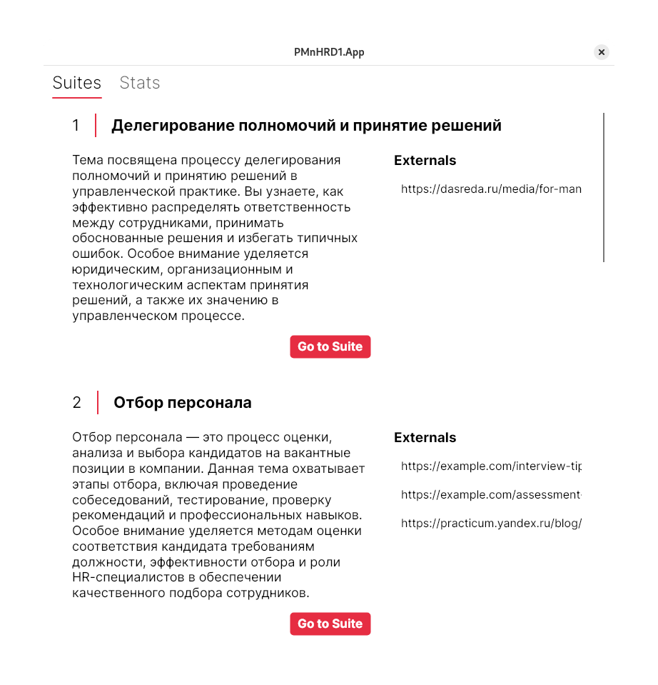

= bsuir-PMnHRD-1

This application is designed to help users complete various psychological tests
about management. It provides a user-friendly interface, twenty one test
separated into seven topics. It includes various test modules such as
personality assessment, stress management, and leadership skills evaluation.

The application was developed as BSUIR task for "Psychology of Management and
Development of Human Resources" subject.

== Installation

=== Windows

Requirements:

. Windows 10 or later
. .NET 8.0 runtime

Installation steps:

. Download the latest *.exe* release from the GitHub repository
. Run the installer

=== Debian-based systems

Requirements:

. Any debian-based system
. link:https://learn.microsoft.com/en-us/dotnet/core/install/linux-debian[Added microsoft dotnet repository]

Installation steps:

. Download the latest *.deb* release from the GitHub repository
. Run `sudo dpkg -i $downloaded_file`

[CAUTION]
====
Not tested yet
====

=== RPM-based systems

Requirements:

. Any RPM-based system
. link:https://learn.microsoft.com/en-us/dotnet/core/install/linux-fedora[Added microsoft dotnet repository]

Installation steps:

. Download the latest *.rpm* release from the GitHub repository
. Run `sudo rpm -i $downloaded_file`

[CAUTION]
====
Not tested yet
====

=== NixOS with channels

. Add overlay as a channel:

[source,shell]
----
sudo nix-channel --add https://github.com/nadevko/bsuir-PMnHRD-1/archive/master.tar.gz bsuir-pmnhrd
sudo nix-channel --update
----

. Add the following to your configuration.nix:

[source,nix]
----
{
  environment.systemPackages = with pkgs; [ bsuir-PMnHRD1-app ];
  config.nixpkgs.overlays = [ (import <bsuir-pmnhrd/nixpkgs>) ];
}
----

[WARNING]
====
Rebuild your system configuration after adding overlay, otherwise the package
will not be available, so rebuild will fail.
====

=== Via nix package manager

System requirements:

. Linux or macOS
. Nix package manager

Installation steps:

. Clone the repository and enter the repository root
. Install the package with `nix-env -i -f ./nixpkgs/pmnhrd1-app.nix`

=== AppImage

Requirements:

. Any Linux distribution
. FUSE

Installation steps:

. Download the latest *.AppImage* release from the GitHub repository

To run application, execute downloaded file

== Usage

After installation, the application can be started from the application menu or
by running `pmnhrd-1` in the terminal.

== Tecnical details

The application is written in C# using .NET 8.0. It uses the AvaloniaUI and
ReactiveUI libraries for the user interface. The application is built using the
pupnet tool and use Xdg.Directories for locating user data.

Location of test results history:

|===
| OS | Location | Default full path

| Windows
| %LOCALAPPDATA%\nadevko-bsuir\PMnHRD1-App\stats.json
| C:\Users\<YourUsername>\AppData\Local\nadevko-bsuir\PMnHRD1-App\stats.json

| Linux
| $XDG_STATE_HOME/nadevko-bsuir/PMnHRD1-App/stats.json
| /home/<YourUsername>/.local/state/nadevko-bsuir/PMnHRD1-App/stats.json
|===
